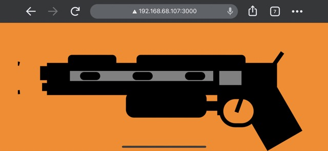
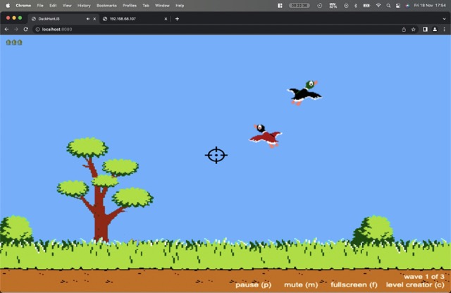

# DUCK HUNT JS v4.0

[Play the game](https://erickwendel.github.io/DuckHunt-JS)

This is a GitHub fork that extends the [MattSurabian 's DuckHunt Implementation.](https://github.com/MattSurabian/DuckHunt-JS)

This fork enables you to use your phone as a machine gun in the game.

## Prints
### Machine Gun on the Phone

### App running on Desktop

## About

This is an implementation of DuckHunt in Javascript and HTML5. It uses the PixiJS rendering engine, Green Sock Animations, Howler, and Bluebird Promises.

## Rendering
This game supports WebGL and Canvas rendering via the PixiJS rendering engine.

## Audio
This game will attempt to use the WebAudioAPI and fallback to HTML5 Audio if necessary. Audio is loaded and controlled via HowlerJS.

## Tweening
The animations in this game are a combination of PixiJS MovieClips built from sprite images and tweens. Since PixiJS doesn't provide a tweening API, Green Sock was used.

## Game Logic
The flow of this game is managed using Javascript. The main chunks of business logic are implemented as ES6 classes which are transpiled to ES5 using Babel.

## Working With This Repo

There are two different services here. [game](./game) is where the DuckHunt game is running and [mobile-controller](./mobile-controller) is the game's machine gun controller.

 - You must have [nodejs 18](https://nodejs.org/) installed.
 - Clone the repo into a directory of your choice

### Mobile Controller
 - `cd` into [mobile-controller](./mobile-controller)  directory and run `npm ci --silent`
- You'll need a SSL certificate to be able to retrive gesture data from mobile devices in browsers such as Chrome. I put a [script](./mobile-controller/generate-cert.sh) that performs an action to generate a localhost cert for you. It uses the [mkcert](https://github.com/FiloSottile/mkcert) so make sure you install it.
- After generating the certificate on the credentials folder, run `npm run dev` and your API will be ready to be used on port **3000**
> Make sure to save your IP (eg. 192.168.68.107). On mac run `ifconfig | grep 192` 
> It'll show you the IP endpoint you'll need to communicate both projects
### Game
 - `cd` into [game](./game) directory and run `npm ci --silent`
 - change the [main.js](./game/main.js) file adding your `local IP` that you stored from the previous step.
 - Use `npm start` to start a local webserver which will make the site available at http://localhost:8080/. 

## Working With Audio and Visual Assets
This repo ships with committed dist files to make it easy for developers to get up and running. If you really want to get into some leet haxing and change the way
this game looks and sounds then you'll need to work with audio and image sprites. The following tasks make that possible: 

 - To rebuild audio assets use `npm run audio` (there is a hard dependency on [ffmpeg](https://ffmpeg.org/download.html) to run this task)
 - To rebuild image assets use `npm run images` (there is a hard dependency on [texturepacker](https://www.codeandweb.com/texturepacker/download) to run this task)

## Bugs
Please report bugs as [issues](https://github.com/MattSurabian/DuckHunt-JS/issues).

## Contributing
Pull requests are welcome! Please ensure code style and quality compliance with `npm run lint` and include any built files.

## Credits

- The Mobile Controller Machine Gun was extended from [Hoangquan123](@Hoangquan123)'s [Code Pen](https://codepen.io/Hoangquan123/pen/QzepvV)
- Thanks to [Hoangquan123](@Hoangquan123) for his amazing job creating the first version of [DuckHunt-JS](https://github.com/MattSurabian/DuckHunt-JS)
- My aim icon was free downloaded on [iconfinder.com](https://www.iconfinder.com/search?q=aim&price=free)
- Here other links that helped me reach this result:
  - https://accelerometerdemo.netlify.app/
  - https://www.sitepoint.com/using-device-orientation-html5/
  - https://web.dev/native-hardware-device-orientation/